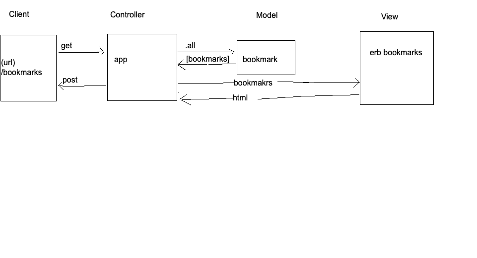

# Bookmark Manager

# Makers week 4 weekly challenge

## User Stories

- As a frequent user of the Internet
So I can visit my favourite websites quickly
I want to see a list of bookmarks

## Domain Models



### To set up the database

 Connect to `psql` and create the `bookmark_manager` database:

 ```
 CREATE DATABASE bookmark_manager;
 ```

 To set up the appropriate tables, connect to the database in `psql` and run the SQL scripts in the `db/migrations` folder in the given order.
 